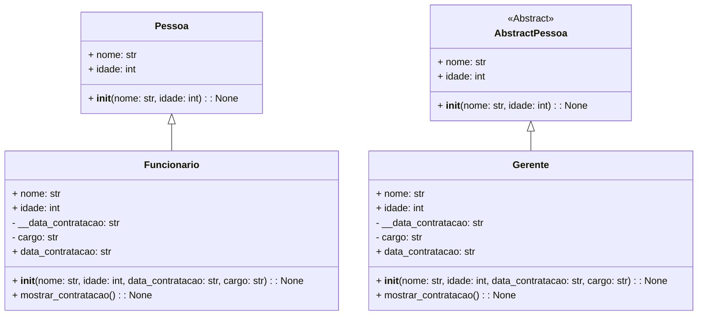

# Orientação a objetos
Alguns exemplos de Orientação a Objetos com Python.

## Diagramas das classes de exemplos

```mermaid
classDiagram
  class Pessoa {
    + nome: str
    + idade: int
    + __init__(nome: str, idade: int): None
  }

  class AbstractPessoa {
    <<Abstract>>
    + nome: str
    + idade: int
    + __init__(nome: str, idade: int): None
  }

  class Funcionario {
    + nome: str
    + idade: int
    - __data_contratacao: str
    - cargo: str
    + data_contratacao: str
    + __init__(nome: str, idade: int, data_contratacao: str, cargo: str): None
    + mostrar_contratacao(): None
  }

  class Gerente {
    + nome: str
    + idade: int
    - __data_contratacao: str
    - cargo: str
    + data_contratacao: str
    + __init__(nome: str, idade: int, data_contratacao: str, cargo: str): None
    + mostrar_contratacao(): None
  }

  Pessoa <|-- Funcionario
  AbstractPessoa <|-- Gerente

```